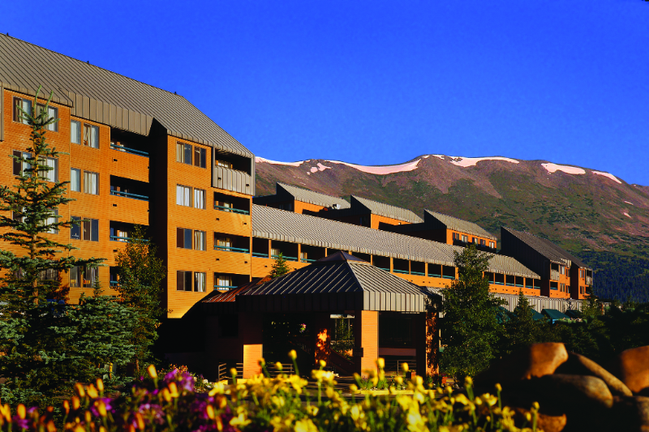

## Accomodation

Students and lecturers will be hosted in the [DoubleTree by Hilton](http://doubletree3.hilton.com/en/hotels/colorado/doubletree-by-hilton-hotel-breckenridge-QKBVRDT/index.html) hotel,
Students will be accomodated in a spatious double-occupancy room with two king beds.

DoubleTree by Hilton will also provide the space where lectures and lab sessions will be held.

**The address of the hotel is**:
```
DoubleTree by Hilton hotel Breckenridge
550 Village Road P.O. Box 8059,
Breckenridge, Colorado, 80424, US
TEL: +1-970-547-5550
```

Breckenridge, surrouned by the Rocky Mountains, is conveniently reached (95 minutes) from Denver International Airport. Shuttle transportation from Denver Airport
to Breckenridge will be arranged through the hotel’s partner, Colorado Mountain Express.

The secluded mountain environment will provide a relaxed and inspiring atmosphere that we believe will be highly conducive to learning,
exchange of ideas, and collaboration, and stimulate students’ creativity as they work on projects.


