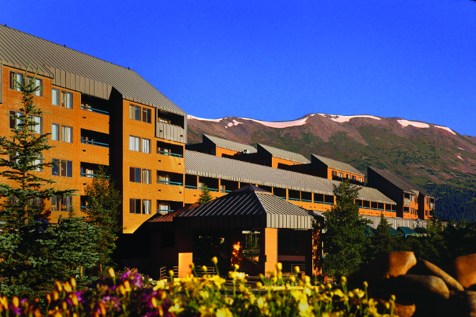

## Location and Accomodation

The secluded mountain environment in Breckenridge will provide a relaxed and inspiring atmosphere. The area provides opportunities for walks and hikes, and also offers restaurants and bars. The atmosphere will be highly conducive to learning,
exchange of ideas, and collaboration.

Breckenridge is conveniently reached (95 minutes) from Denver International Airport. Shuttle transportation from Denver Airport
to Breckenridge will be arranged through the hotel’s partner, Colorado Mountain Express.

Students and lecturers will be hosted in the [DoubleTree by Hilton](http://doubletree3.hilton.com/en/hotels/colorado/doubletree-by-hilton-hotel-breckenridge-QKBVRDT/index.html) hotel.
Students will be accomodated in a spatious double-occupancy room with two king beds.

DoubleTree by Hilton will also provide the space where lectures and lab sessions will be held.

**The address of the hotel is**:
```
DoubleTree by Hilton hotel Breckenridge
550 Village Road P.O. Box 8059,
Breckenridge, Colorado, 80424, US
TEL: +1-970-547-5550
```


